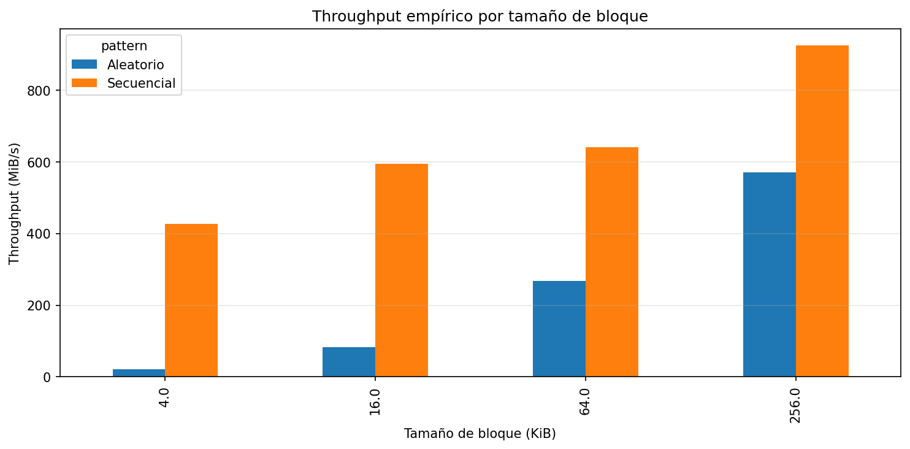
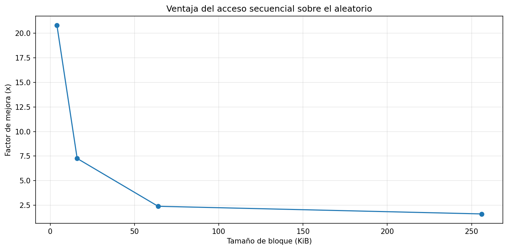
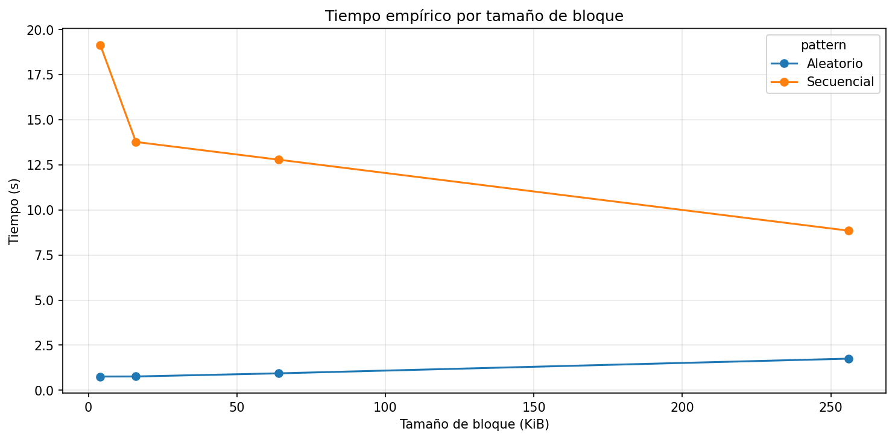
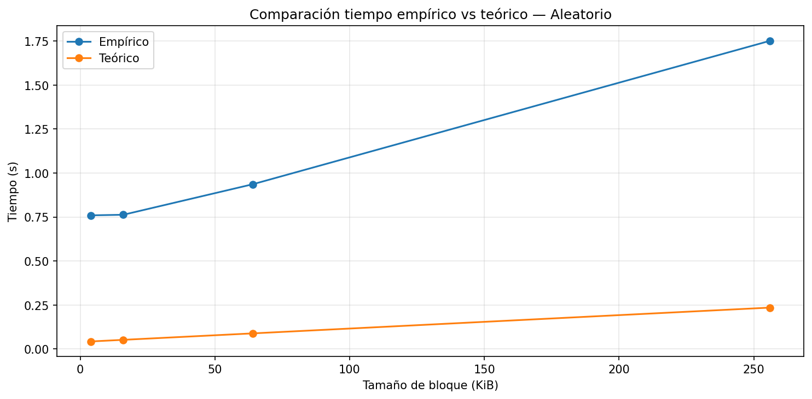
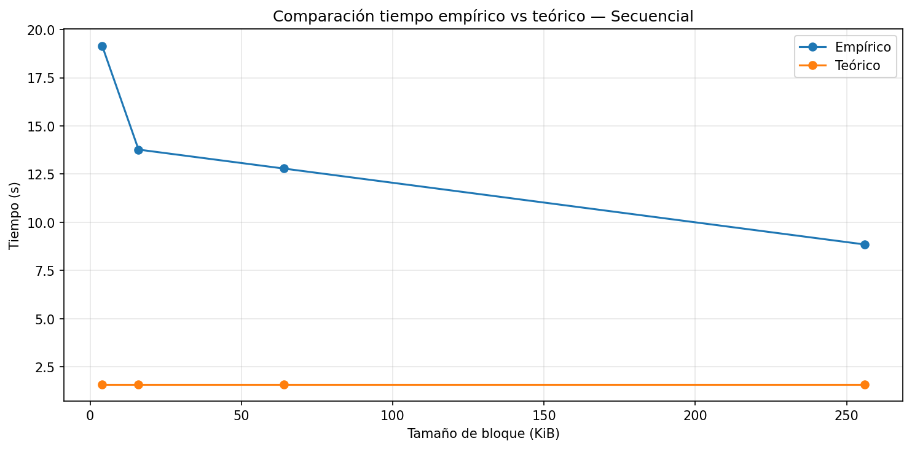

# lab3-IO_performance-LauraVanessaBoteroGil

## 1. Especificaciones del Equipo

| Parámetro | Valor Observado |
|-----------|----------------|
| Sistema Operativo | Windows 11 25H2 |
| CPU (Modelo y Frecuencia) | Intel i5-11400H @ 2.70GHz |
| Arquitectura y Núcleos | X64 / 6 Núcleos físicos |
| Memoria RAM Total | 8 GB DDR4 |
| Tecnología de Almacenamiento | SSD NVMe Micron 2400 512 GB |
| Carga de CPU en Reposo (%) | < 8% |

---
Al tener una memoria RAM DE 8GB Modifique el archivo a FILE_SIZE_MB = 8192

## 2. Resultados del Experimento

---

## 3. Análisis y Conclusiones

En un disco la información se almacena en bloques de bytes, es importante porque debemos saber que al realizar una búsqueda independiente del numero de bytes se va a recorrer el disco por bloques completos, teniendo así el mismo gasto 1 byte que 8 bytes en caso de encontrase en el mismo bloque. Es por eso por lo que el acceso secuencial tiene un mejor desempeño que el acceso aleatorio porque al encontrarse la información requerida en el mismo bloque, es como hacer el recorrido una sola vez, en cambio si está en lugares aleatorios, es como saltar entre posiciones entre los bloques, llevándose más tiempo ese posicionamiento para la lectura. Por ejemplo, con bloques de 4 KiB el acceso secuencial alcanzó 427.76 MiB/s, mientras el aleatorio solo llegó a 20.57 MiB/s, una ventaja de aproximadamente 20.8 veces. Por otra parte, el modelo teórico no se acerco al comportamiento real de mi equipo, pues solo para el acceso secuencial estimó aproximadamente 5119.97 MiB/s lo cual fue un valor muy alto para el real, asimismo con los demás valores teóricos estimados, siendo valores muy diferentes por la existencia de otros posibles factores que alteraron los resultados. De acuerdo a los resultados de la medición real y los teóricos, trataría de hacer diseños con lecturas secuenciales y no aleatorias.

---

### Pregunta 1 — Comparación de patrones de acceso

El acceso secuencial fue más rápido que el aleatorio en todos los bloques que se trabajaron, específicamente si hablamos del throughput, en el que mayor diferencia se notó fue en el bloque de 4KB, donde se obtuvo una diferencia de 427.757734 MiB/s en el secuencial y 20.570129 MiB/s en el aleatorio, siendo el secuencial 20.8 veces más rápido. Sí era esperado por la teoría que la búsqueda secuencial sea más rápido, sin embargo los valores son muy diferentes. Para los demás datos siempre hay una diferencia como se muestra en la tabla:

| Tamaño de bloque | Speedup (seq / rnd) |
|-----------------|---------------------|
| 4 KiB | 20.795093× |
| 16 KiB | 7.259841× |
| 64 KiB | 2.398235× |
| 256 KiB | 1.620796× |

---

### Pregunta 2 — Efecto del tamaño de bloque

En el caso del throughput en el acceso aleatorio aumento más que en el secuencial, sin embargo la diferencia con respecto al bloque de 4KB fue disminuyendo a medida que aumentaban los datos, comenzando con 20.79 en 4KB y terminando con 1.62 en el mayor bloque, esto se debe a algo similar a lo visto en clase con el carro y el bus, pues al acceder a más datos, el costo de moverse a la ubicación de ellos disminuye.

---

### Pregunta 3 — Teoría vs. práctica

La diferencia más grande que vi fue entre los accesos secuenciales teóricos y empíricos, sobre todo cuando se probò en el bloque de 256 KiB, teóricamente proponía 5119.97 MiB/s, pero máximo se alcanzó 925.56 MiB/s. Estas diferencias teóricas y empíricas pueden ser debido a programas que se ejecutaran en segundo plano, el sistema operativo y demás.

---

### Pregunta 4 — Tipo de disco

De acuerdo con las tablas vistas en clase, mi computador se compara más a un SSD que a un HDD, pues según lo visto una HDD suele tener latencia de 5-15ms, un throughput secuencial de 100-200 MiB/s y aún más costoso el acceso aleatorio. En mis mediciones el acceso secuencial llego hasta 925.56 MiB/s y el aleatorio a 571.05 MiB/s, valores mucho mayores que los de una HDD, en el caso de saber si es SATA o NVMe, debido a posibles problemas de rendimiento no alcanza los óptimos de NVMe, sin embargo en el caso en que alcanzaba 925.56 MiB/s se supera el valor típico de SATA, por lo cual se asume que es NVMe.

---

### Pregunta 5 — Aplicación práctica

Si tuviera que hacer una tabla de estudiantes con 1 millón de registros preferiría leerla de forma secuencial y en bloques grandes que aleatoria, pues según las mediciones de esta forma se aprovecha mucho más el disco.

---

### Pregunta adicional 1 — Diferencial de desempeño

Como se menciona anteriormente el patron de acceso mas eficiente es el secuencial. La ventaja sobre el acceso aleatorio fue de 20.8x en 4 KiB, 7.26x en 16 KiB, 2.40x en 64 KiB y 1.62x en 256 KiB, aun así la ventaja disminuye a medida que el tamaño del bloque crece.

---

### Pregunta adicional 2 — Efecto del tamaño de bloque en el acceso aleatorio

El tamaño influye porque al acceder a un bloque pequeño el acceso tiene una latencia más alta, mientras que al trabajar con bloques más grandes la latencia se divide por así decirlo entre más bytes, por lo que el rendimiento mejora el costo.

---

### Pregunta adicional 3 — Correlación con la teoría

Mi hardware se alejo sobre todo en el acceso secuencial, esto se puede deber al caché del sistema operativo, coinciden las tendencias, pero no los valores.

---

### Pregunta adicional 4 — Costo del acceso aleatorio en SSD

Esto se debe a que aun así al tener un acceso aleatorio se deben hacer redireccionamientos dentro de la unidad, entender la lógica y el controlador, en cambio para el secuencial se ahorra en tiempo el realizar estas acciones de forma repetitiva.

---

### Pregunta adicional 5 — Implicaciones en diseño de motores de base de datos

Utilizaria lecturas secuenciales en grandes bloques, además de acuerdo a lo visto en clase, utilizaría un índice para disminuir accesos aleatorios y trataría de agrupar los registros.
